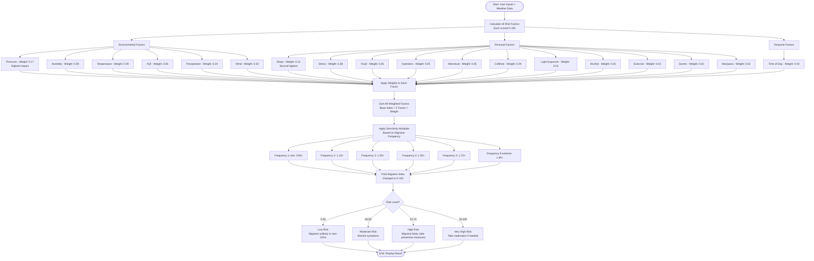

# Migraine Predictor Logic Summary

## Overview
This app uses a **predictive approach** to estimate migraine risk in the next 12 hours based on environmental data and personal factors.

## Risk Calculation Flowchart



## Formula

```
Migraine Index = [Σ (Factor_Risk × Factor_Weight)] × Sensitivity_Multiplier
```

Where:
- **Factor_Risk**: Individual risk score for each factor (0-100)
- **Factor_Weight**: Research-based weight for each factor (totaling 1.0)
- **Sensitivity_Multiplier**: `0.80 + (frequency × 0.20)` = Range from **1.0 to 2.0**

## Factor Weights (Total = 1.0)

### Environmental Factors (0.51)
- **Pressure**: 0.17 (most studied environmental factor)
- **Humidity**: 0.09 (28% increase in odds)
- **Temperature**: 0.09 (19-24% increase)
- **AQI**: 0.06 (3-5% per IQR)
- **Precipitation**: 0.04 (related to pressure changes)
- **Wind**: 0.02 (proxy for weather fronts)
- **Time**: 0.04 (circadian patterns)

### Personal Factors (0.49)
- **Sleep**: 0.13 (major personal trigger)
- **Stress**: 0.08 (cortisol pathway)
- **Food**: 0.05 (blood sugar trigger)
- **Hydration**: 0.05 (dehydration trigger)
- **Menstrual**: 0.05 (hormonal fluctuations)
- **Caffeine**: 0.04 (withdrawal/overuse)
- **Light Exposure**: 0.03 (photosensitivity)
- **Alcohol**: 0.03 (vasodilation/dehydration)
  - **+15 risk** if contains red wine (histamines, tyramine, tannins)
  - **+12 risk** if contains beer (histamines, tyramine)
- **Exercise**: 0.03 (helps or triggers)
- **Scents**: 0.02 (trigeminal trigger)
- **Marijuana**: 0.02 (complex relationship)

## Sensitivity Multiplier

Based on migraine frequency (1-6 scale):

| Frequency | Description | Multiplier | Effect |
|-----------|-------------|------------|--------|
| 1 | Rare (< 1/month) | 1.0× | Baseline (no adjustment) |
| 2 | Occasional (1-3/month) | 1.2× | +20% baseline |
| 3 | Frequent (4-7/month) | 1.4× | +40% baseline |
| 4 | Very Frequent (8-10/month) | 1.6× | +60% baseline |
| 5 | Chronic (11-14/month) | 1.8× | +80% baseline |
| 6 | Extreme (15+/month) | 2.0× | +100% baseline (2x) |

## Predictive vs Diagnostic

### Predictive (This App)
- Estimates risk **in the next 12 hours**
- Uses current environmental conditions + personal factors
- Helps users take **preventive action**
- Based on research correlations, not diagnostic criteria

### Diagnostic (Medical)
- Diagnoses an **ongoing migraine**
- Uses symptoms, duration, medical history
- Performed by healthcare professionals
- Based on clinical diagnostic criteria

## Key Features

1. **Real-time Weather Integration**: Fetches current and historical weather data
2. **Pressure Change Tracking**: Monitors 24-hour pressure drops (highly triggering)
3. **Temperature Change Tracking**: Rapid temperature changes increase risk
4. **Regular Consumer Logic**: Tracks usual intake vs today's intake for caffeine, alcohol, exercise, and marijuana
5. **Menstrual Cycle Tracking**: Highest risk 2 days before through first 3 days of menstruation
6. **Advanced Mode**: Optional detailed inputs for power users

## Special Notes

- **Red Wine & Beer**: Classified as higher-risk alcohol types due to histamines and tyramine
- **Pressure Changes**: Rapid drops are more triggering than stable low pressure
- **Regular Consumers**: Withdrawal (less than usual intake) can trigger migraines
- **Caffeine Calculator**: Optional detailed breakdown (coffee, energy drinks, tea, medications)
